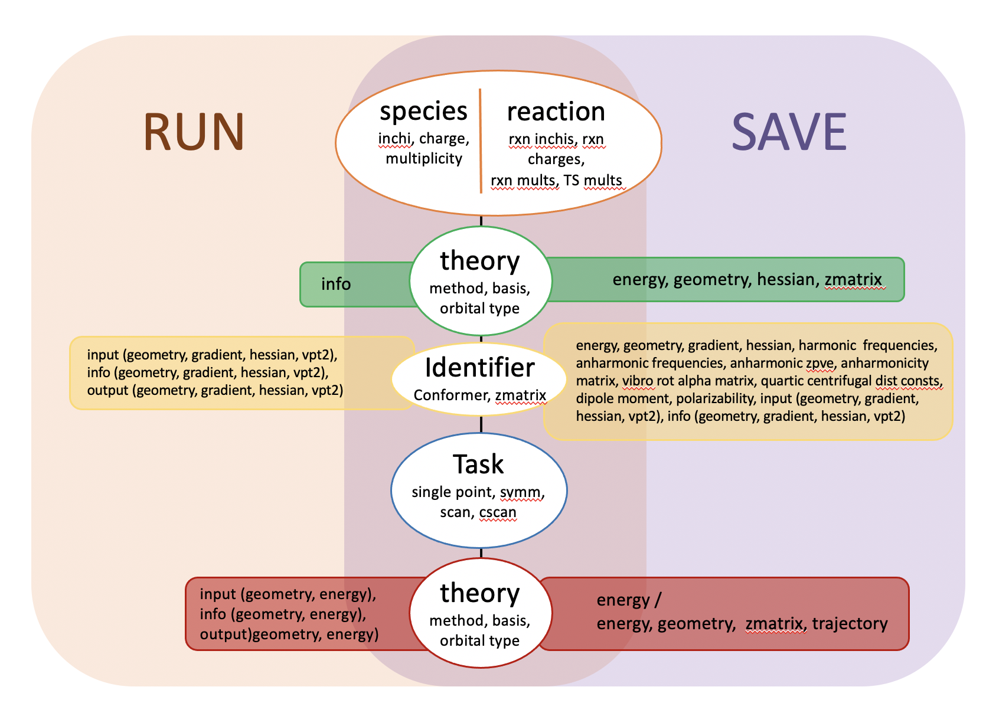

Autofile
=========

*A Package of the AutoMech Suite*

Andreas V. Copan, Kevin B. Moore III, Sarah N. Elliott, and Stephen J. Klippenstein

--------------------------------------------------------------------------------------

.. toctree::
    :glob:
    :maxdepth: 2

    index
--------------------------------------------------------------------------------------

Overview
~~~~~~~~

Autofile directs the filesystem framework for the AutoMech suite.  It uses a dual architecture: the run/save filesystems. 
Under each, Autofile defines rigid Dataseries trunks, branches, and leaves that each store specific data. The save system is the 
database for AutoMech, storing molecular properties like electronic energies, hessians, and torsional profiles as well as
and transition state information like transitory bonds and reaction types.

Getting Started
~~~~~~~~~~~~~~~
Installation
^^^^^^^^^^^^^
.. code-block:: python

    >>> conda install autofile -c auto-mech

Tutorial
^^^^^^^^
The first step is to make sure the installation was successful by importing autofile

.. code-block:: python

    >>> import autofile

Then we can move on to using the autofile module:

* Species filesystem\: :ref:`spc-tutorial-doc`
* Theory filesystem\: :ref:`thy-tutorial-doc`
* Conformer filesystem\: :ref:`cnf-tutorial-doc`
* Z-matrix filesystem\: :ref:`zmat-tutorial-doc`
* Scan filesystem\: :ref:`scn-tutorial-doc`
* Reaction filesystem\: :ref:`rxn-tutorial-doc`
* TS filesystem\: :ref:`ts-tutorial-doc`

Documentation
~~~~~~~~~~~~~
    .. toctree::
        :maxdepth: 4
    
        submodule_fs
        submodule_model
        submodule_schema
        submodule_data_types
        submodule_info
        submodule_io
        submodule_json

